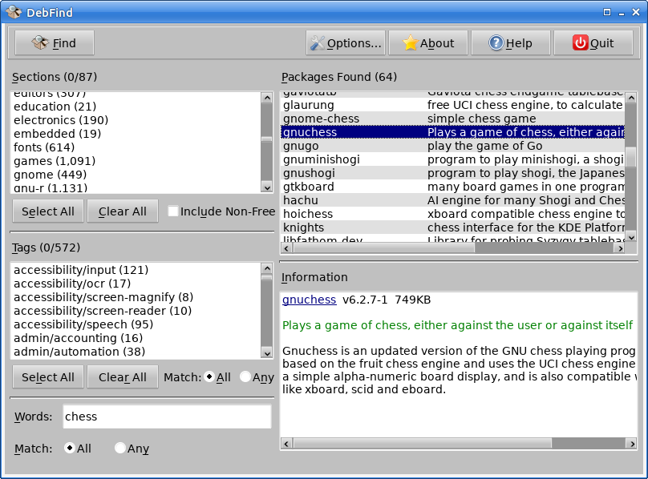

# debsearch

An tools and package for finding Debian packages.

There is a debsearch Go package, plus `debsearch` a command line tool, and
`DebFind` a GUI application.

Both `debsearch` and `DebFind` are run as an ordinary user and are very
fast.

Searching can be by Section, Tags, and words (found in the name and short
and long descriptions), in any combination.

## License

GPL-3

---
